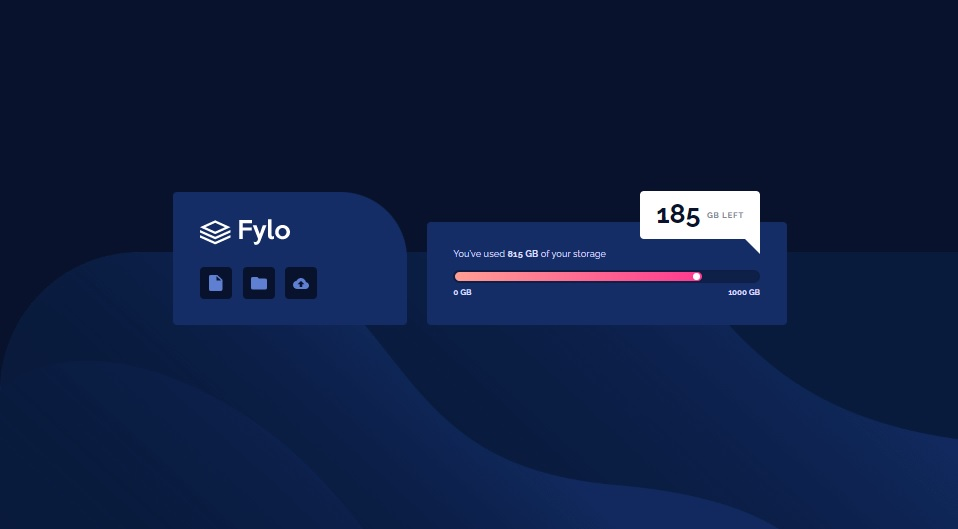
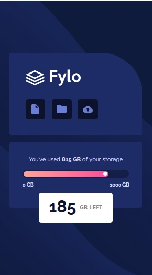
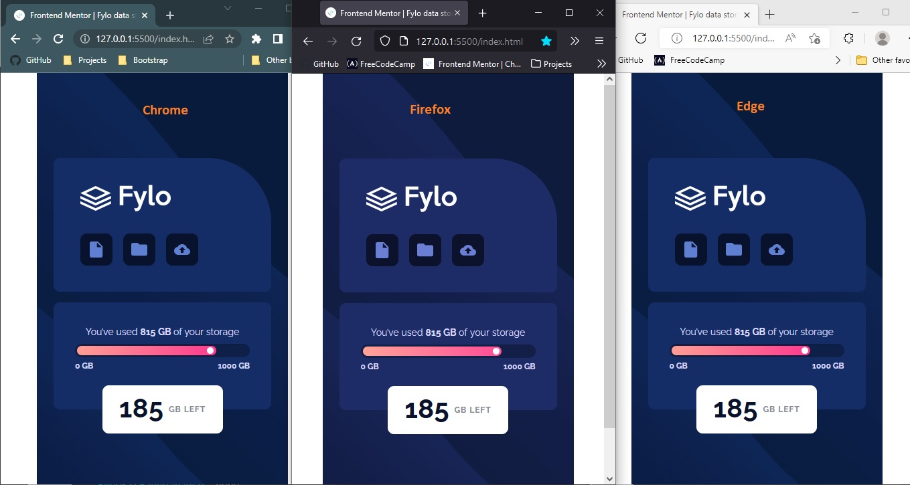

# Frontend Mentor - Fylo data storage component solution

This is a solution to the [Fylo data storage component challenge on Frontend Mentor](https://www.frontendmentor.io/challenges/fylo-data-storage-component-1dZPRbV5n). Frontend Mentor challenges help you improve your coding skills by building realistic projects.

## Table of contents

- [Overview](#overview)
  - [The challenge](#the-challenge)
  - [Screenshot](#screenshot)
  - [Links](#links)
- [My process](#my-process)
  - [Built with](#built-with)
  - [What I learned](#what-i-learned)
  - [Continued development](#continued-development)
  - [Useful resources](#useful-resources)
- [Author](#author)
- [Acknowledgments](#acknowledgments)

## Overview

### The challenge

Users should be able to:

- View the optimal layout for the site depending on their device's screen size

### Screenshot

| Desktop layout |
| :------------: |



| Mobile layout |
| :-----------: |



### Links

- Solution URL: (https://github.com/PavlinaPs/fylo-data-storage-component)
- Live Site URL: (https://pavlinaps.github.io/fylo-data-storage-component/)

## My process

### Built with

- Semantic HTML5 markup
- CSS custom properties
- Flexbox
- Mobile-first workflow

### What I learned

Another great challenge. A lot of things to think about!
I enjoyed it very much.

- ##### \<progress> element

  I have to say I didn't know it existed until this challenge. Soon enough I found out why. It is the browser support and the styling is quite complicated.

  ```html
  <progress
    class="progress-bar"
    name="used"
    id="used-slider"
    max="1000"
  ></progress>
  ```

  The value attribute is supplied by JavaScript.
  With the help of an old CSS Tricks article "The HTML5 progress Element" I was able to style it up.
  | Styled progress element in browsers |
  | :------------: |
  

- ##### The dot

  It went fine until I tried to add the white dot at the end of the progress bar. I wasn't able to use neither position or pseudo-element. I solved it by wrapping the progress element and the dot in a div, which I could make a parent element and position the dot absolutely to it.

- ##### Multiple labels

  I also discovered with this challenge, that multiple labels can be associated with the same form control:

  ```html
  <div class="label-wrapper">
    <label for="used">0 GB</label>
    <label for="used">1000 GB</label>
  </div>
  ```

- ##### JavaScript

  I decided to add a little of JavaScript to display the correct size of the progress bar. I imagine the information about used storage comes from some backend.

  ```js
  let availableStorage = 1000;
  let used = 815;
  let left = availableStorage - used;

  // slider value
  const usedSlider = document.getElementById("used-slider");
  usedSlider.setAttribute("value", used);
  ```

- ##### Styling numbers

  First I thought I'd need the help of JavaScript to style the digits as they seemed that every digit was on a different position vertically. I coded it up, nicely split the numbers to digits and sent them to html one by one where a respective class were applied to it.
  Then realized, the vertical position of digits was the font's feature! Never mind, I can do it, I can write a JavaScript for this situation and that's what the challenges are for, aren't they? Im happy anyway :-)

- ##### The triangle
  I styled the tooltipy-sh element in desktop view by adding an absolutely positioned triangle.
  ```css
  .left::after {
    content: "";
    width: 0;
    height: 0;
    position: absolute;
    right: 0;
    bottom: -2.2rem;
    border-top: 2.3rem solid transparent;
    border-bottom: 2.3rem solid transparent;
    border-right: 2.3rem solid var(--white);
  }
  ```

### Continued development

I would like to code this challenge again, in a contemporary way, without the progress element.
And I would like to keep the habit of displaying the work in all browsers as in this challenge plus add Safari.

### Useful resources

- [\<progress>: The Progress Indicator element](https://developer.mozilla.org/en-US/docs/Web/HTML/Element/progress) on MDN
- [The HTML5 progress Element](https://css-tricks.com/html5-progress-element/) - The CSS Trick's article
- [Custom styling progress bar in CSS](https://stackoverflow.com/questions/42290719/custom-styling-progress-bar-in-css) on Stack Overflow
- [20 Amazing CSS Progress](https://alvarotrigo.com/blog/progress-bar-css/) - A blog on alvarotrigo.com
- [CSS Progress Bar Tutorial](https://youtu.be/basf1lH1H-E) - a YouTube video by WDS, Kyle's another great tutorial
- [\<label>: The Input Label element](https://developer.mozilla.org/en-US/docs/Web/HTML/Element/label) on MDN

## Author

- Website - [My portfolio](https://pavlinaps.github.io/my-portfolio/)
- Frontend Mentor - [@PavlinaPs](https://www.frontendmentor.io/profile/PavlinaPs)
- Twitter - [@PPsarsky](https://www.twitter.com/PPsarsky)

## Acknowledgments

It is great that I can solve Frontend Mentor's challenges. They are all very useful for me. Every single one. Thank you!
